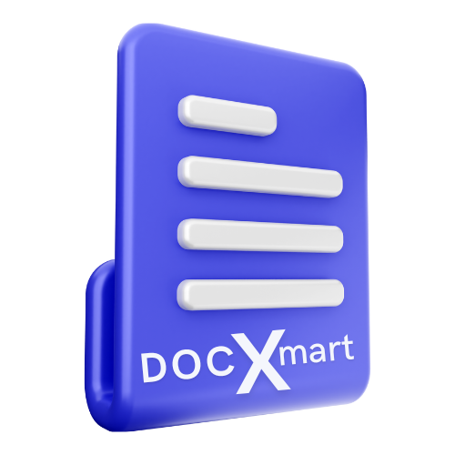
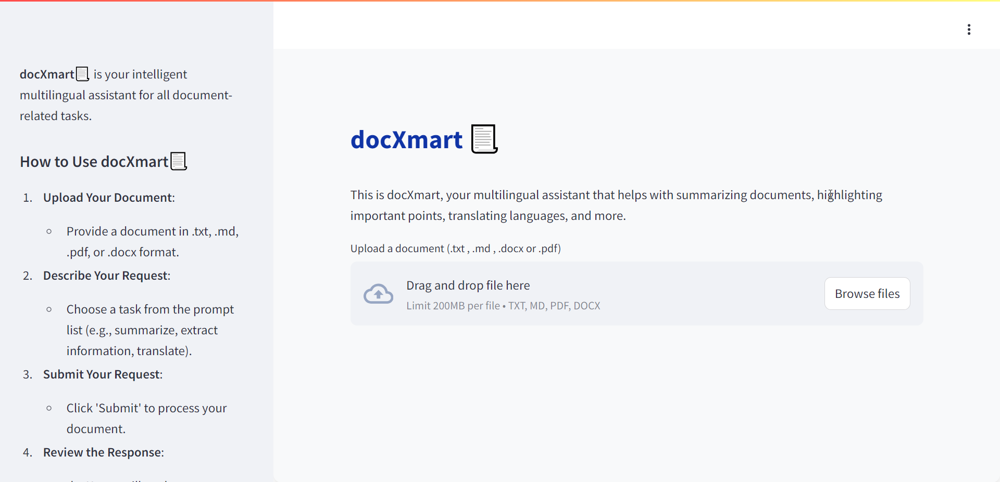
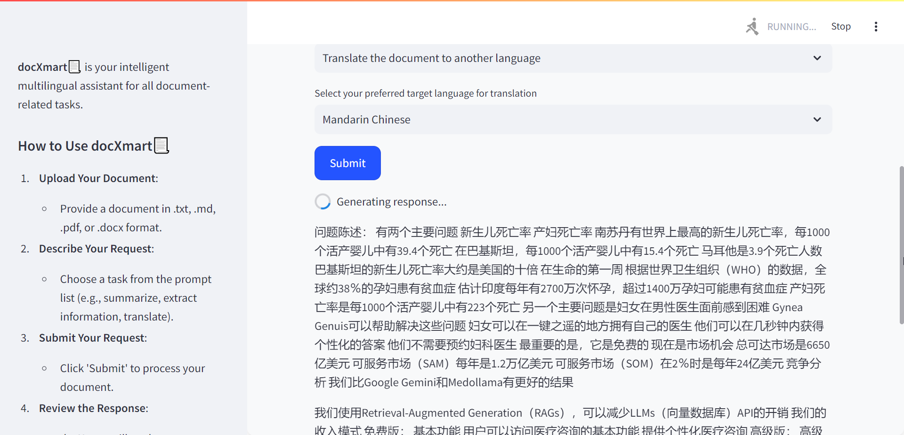
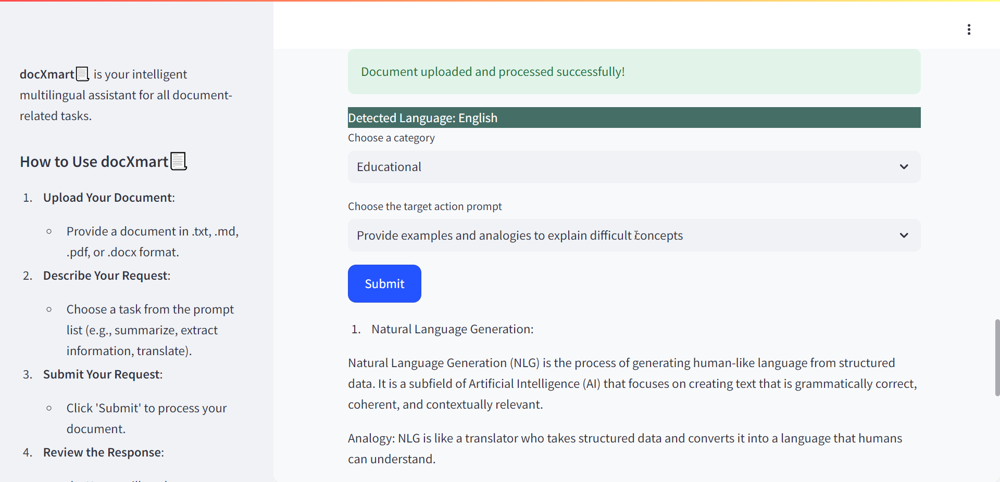
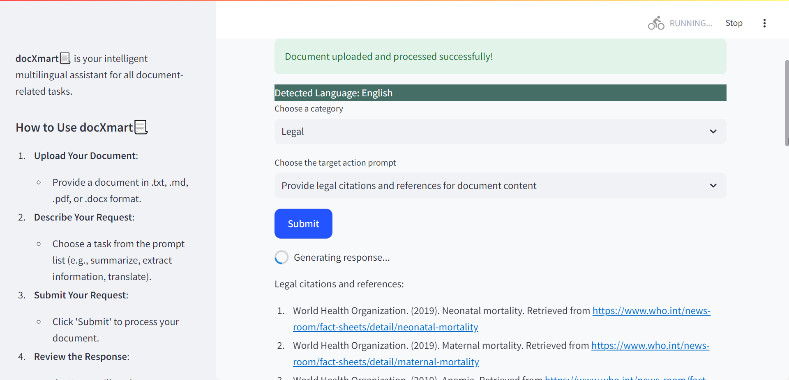
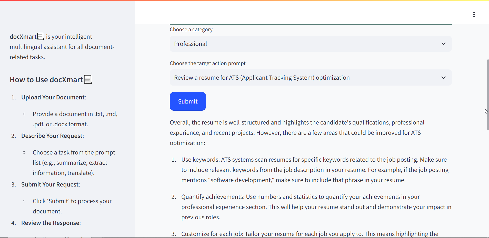

# docXmart 📃

docXmart is your intelligent multilingual assistant for all document-related tasks, including summarizing, extracting information, translating, and more. It leverages the AI71 API to provide accurate and detailed responses based on user inputs.

## Features

- **Document Upload**: Supports .txt, .md, .pdf, and .docx formats.
- **Language Detection**: Automatically detects the language of the uploaded document.
- **Task Selection**: Offers a variety of tasks such as summarizing, extracting information, translating, and more.
- **Multilingual Translation**: Supports translation into multiple languages.
- **Real-time Response Generation**: Generates responses in real-time with smooth flow and transition.

## How to Use

1. **Upload Your Document**:
   - Provide a document in .txt, .md, .pdf, or .docx format.

2. **Describe Your Request**:
   - Choose a category from the prompt list:
      - **General Prompts**:
          - Translate the document to another language
          - Review and correct grammatical errors in the document
          - Generate a concise summary of the document
          - Extract specific information such as dates, names, and places from the document
          - Determine the sentiment (positive, negative, neutral) expressed in the document
          - Create new text based on the document’s content
          - Expand on ideas or topics mentioned in the document
          - Identify the main theme or subject of the document
          - Rewrite sections of text to improve clarity or readability
          - Identify and classify entities such as people, organizations, locations, and dates in the document
          - Suggest improvements for style and readability of the document
          - Identify and list important keywords or phrases from the document
          - Analyze and identify recurring themes or topics within the document
      - **Educational Prompts**:
          - Generate text for PowerPoint slides based on the document
          - Generate study notes based on the document
          - Summarize educational content for easier understanding
          - Create quiz questions based on the educational document
          - Develop lesson plans or teaching materials from the document
          - Provide examples and analogies to explain difficult concepts
          - Identify and suggest additional resources for further reading
          - Generate discussion questions to encourage critical thinking
          - Analyze the document for educational standards alignment
          - Suggest some possible visual aids that could be created based on the document
          - Assess the readability level of the educational content
      - **Legal Prompts**:
          - Summarize legal documents and extract key points
          - Translate legal documents to another language
          - Identify key legal terms and definitions within the document
          - Check for compliance with legal standards and regulations
          - Draft legal contracts or agreements based on provided information
          - Analyze and identify potential legal risks or issues
          - Provide legal citations and references for document content
          - Review and correct legal document formatting and structure
          - Generate a timeline of events based on the legal document
          - Assess the strength of arguments in legal documents
          ### Professional Prompts
          - Review and improve a resume
          - Summarize a CV
          - Extract key skills and qualifications from a   resume
          - Generate a professional summary based on a   resume
          - Tailor a resume for a specific job
          - Identify strengths and weaknesses in a resume
          - Convert a resume to a different format
          - Review a resume for ATS (Applicant Tracking   System) optimization
          - Create a cover letter based on a resume
        
3. **Submit Your Request**:
   - Click 'Submit' to process your document.

4. **Review the Response**:
   - docXmart will analyze your document and generate a detailed response based on your instructions.

## Installation

1. Clone the repository:
    ```bash
    git clone https://github.com/yourusername/docXmart.git
    ```
2. Install the required dependencies:
    ```bash
    pip install -r requirements.txt
    ```
3. Run the Streamlit app:
    ```bash
    streamlit run app.py
    ```

## Usage

1. Navigate to the local server where the Streamlit app is running.
2. Upload a document using the file uploader.
3. Select the desired task from the prompt list.
4. Click 'Submit' and wait for the response to be generated and displayed.

## Project Flow

1. **User Uploads Document**: The user uploads a document using the file uploader.
2. **Document Processing**: The document is read and processed to detect its language and split into manageable chunks if necessary.
3. **Task Selection**: The user selects a task and, if applicable, a target language for translation.
4. **Prompt Generation**: Prompts are generated based on the user's task selection and document chunks.
5. **Response Generation**: The AI71 API is called to generate responses for each document chunk.
6. **Display Response**: The responses are displayed in real-time with a smooth flow to the user.

## docXsmart Website

Below is a high-level flow for the docXmart project.



## General:


## Educational: 


## Legal:


## Professional:


## Dependencies

- Streamlit
- ai71
- chardet
- fitz (PyMuPDF)
- langid
- pycountry
- re
- asyncio

## Contributing

We welcome contributions to docXmart! Please fork the repository and submit pull requests.

## License

This project is licensed under the MIT License.

## Acknowledgements

We thank the developers of the AI71 API and all the open-source contributors especially Malaika Farooq, Uroosa Saad, Fareed Khan, and Usama Nisar Khan who made this project possible.
